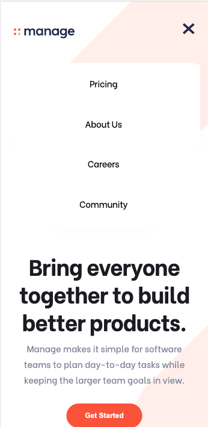
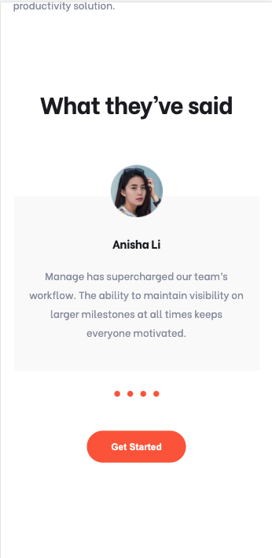
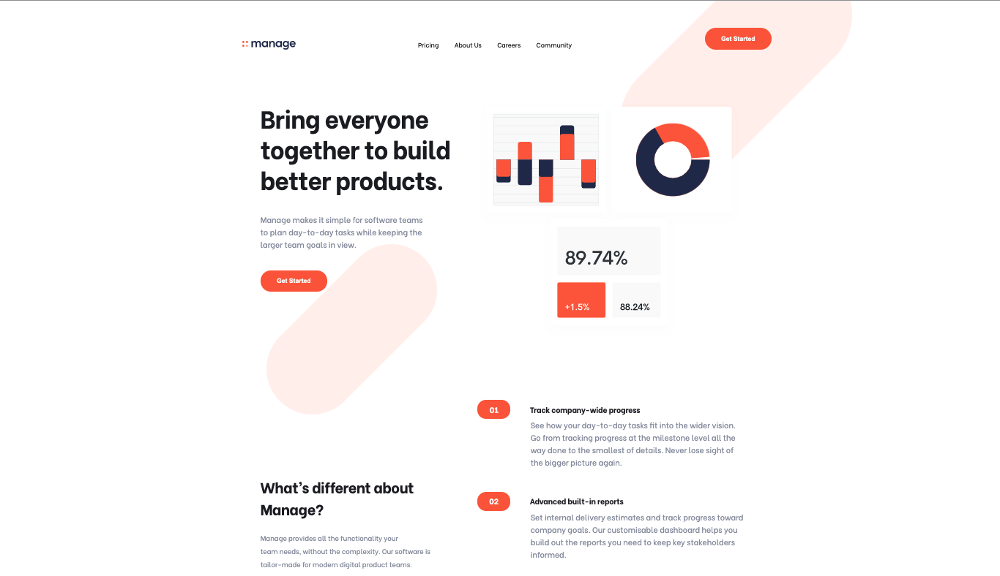

# Frontend Mentor - Manage landing page solution

This is a solution to the [Manage landing page challenge on Frontend Mentor](https://www.frontendmentor.io/challenges/manage-landing-page-SLXqC6P5). Frontend Mentor challenges help you improve your coding skills by building realistic projects.

## Table of contents

- [Overview](#overview)
  - [The challenge](#the-challenge)
  - [Screenshot](#screenshot)
  - [Links](#links)
- [My process](#my-process)
  - [Built with](#built-with)
  - [What I learned](#what-i-learned)
  - [Continued development](#continued-development)
  - [Useful resources](#useful-resources)
- [Author](#author)
- [Acknowledgments](#acknowledgments)

## Overview

### The challenge

Users should be able to:

- View the optimal layout for the site depending on their device's screen size
- See hover states for all interactive elements on the page
- See all testimonials in a horizontal slider
- Receive an error message when the newsletter sign up `form` is submitted if:
  - The `input` field is empty
  - The email address is not formatted correctly

### Screenshot

|               mobile-1               |              mobile-2               |               desktop                |
| :----------------------------------: | :---------------------------------: | :----------------------------------: |
|  |  |  |

### Links

- Live Site URL: [Site Link](https://manage-landing-page-master-74c0w8b9q-tristansetha.vercel.app/)

## My process

### Built with

- Semantic HTML5 markup
- CSS custom properties
- Flexbox
- CSS Grid
- [React](https://reactjs.org/) - JS library
- [Next.js](https://nextjs.org/) - React framework

### What I learned

Next.js, CSS modules

### Continued development

Next.js, architecture, module bundlers, testing

## Author

tristansetha@gmail.com

## Acknowledgments

- jrgarciadev's useMediaQuery hook [next.js/discussions/14810](https://github.com/vercel/next.js/discussions/14810)
- webdev simplified's useToggle hook [useful-custom-react-hooks](https://github.com/WebDevSimplified/useful-custom-react-hooks)
